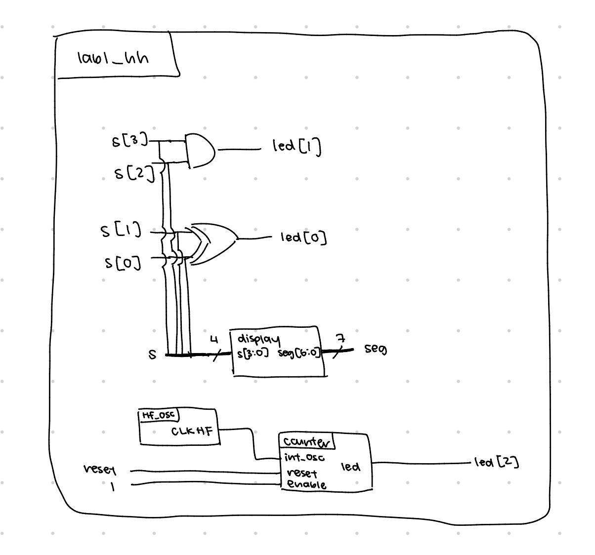
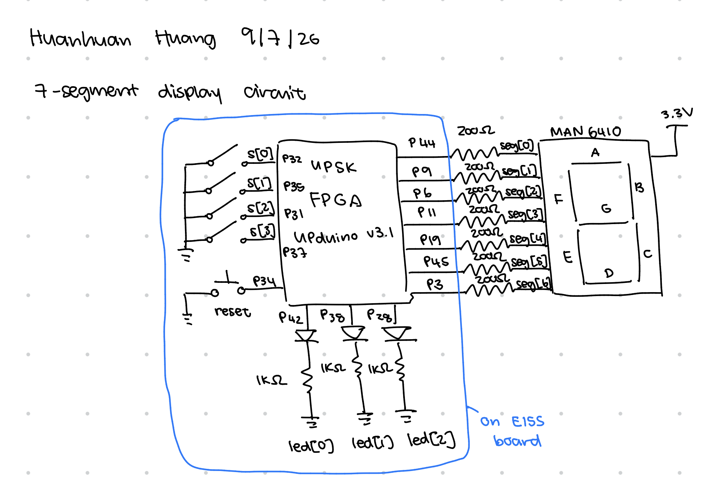
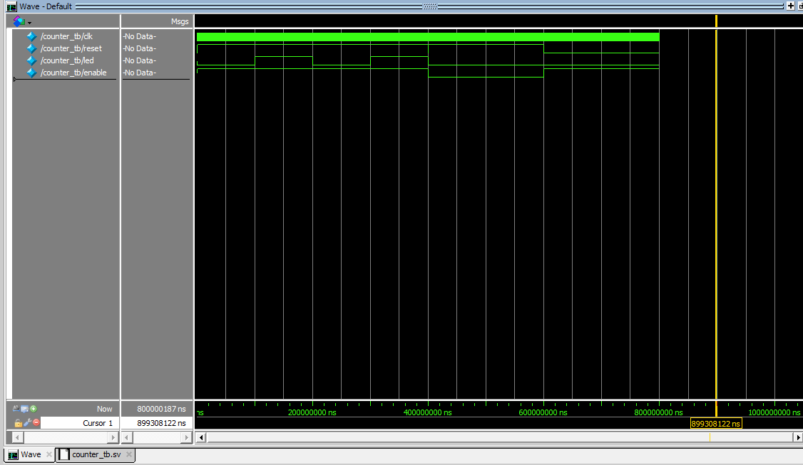
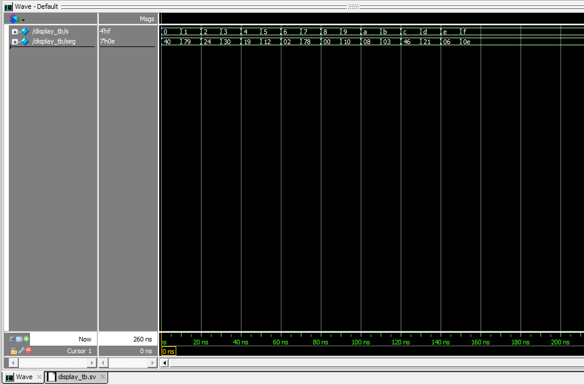
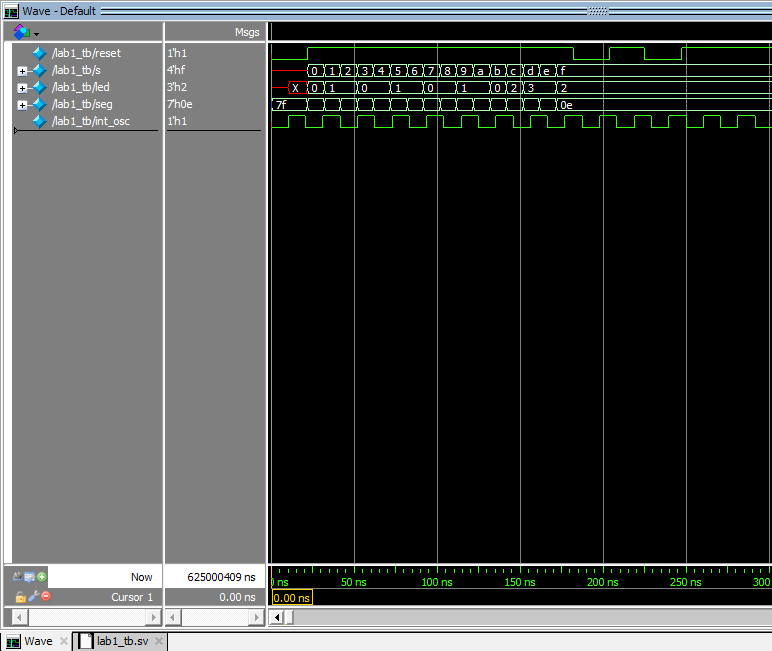
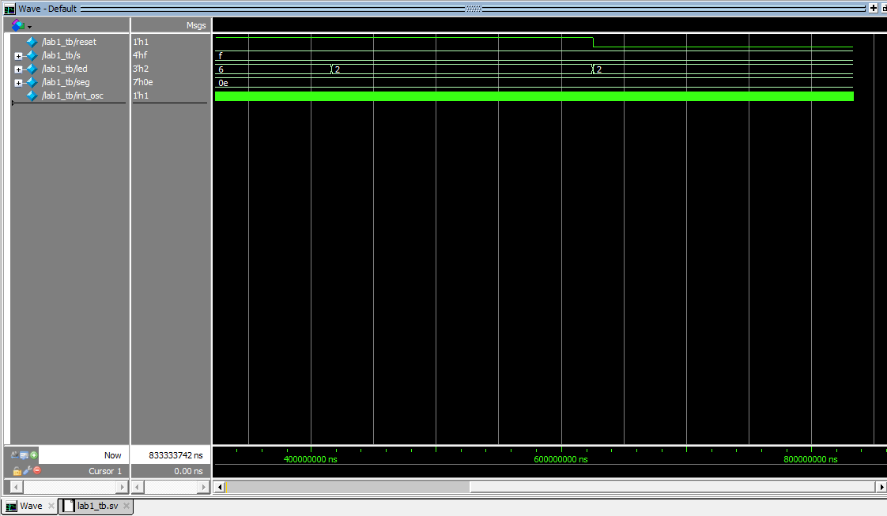

# Introduction
In this lab, the E155 board was assembled, and an FPGA was programmed to control a seven segment display as well as on-board LEDs. A four switch DIP switch was used to control two on-board LEDs as well as the value shown on the seven segment display. A high speed oscillator configured at 48MHz was used to control an LED to blink at 2.4Hz. 

# Design and Testing Methodology
The RTL was structured as a top level module with two submodules. The two submodules were a counter that converted the 48MHz from the high speed oscillator to a 2.4Hz signal on the LED, and a display that would control how different switch configurations translated into turning the seven segments of the display on or off. The top level module called the two submodules and also implemented logic for the two on board LEDs that were controlled by the switches. 

Since the high speed oscillator was at 48MHz but the desired blinking frequency is 2.4Hz, the counter had to count to 10,000,000 oscillator cycles before turning the LED on or off. If the desired blinking frequency is 2.4Hz, then for one single blink, the LED is ON for half of the time and OFF for the other half of the time in this one cycle, so the period of each blink would be 1/4.8 seconds. Since one oscillator cycle is 48MHz, the period is 1/48M seconds, which is 10,000,000 times shorter than 1/4.8 seconds, so the counter counts to 10,000,000. 

$$ \frac{1}{4.8Hz} = N \cdot \frac{1}{48MHz}$$
$$N = 10000000$$

The minimum number of bits needed to store this number is 24, so the counter stored the count in a 24 bit register. I thought to use the push buttons on the E155 board as the reset signal that would force the count to 0 upon push. However, these push buttons are active high, so instead of forcing the count to 0 when reset is ON, count is forced to 0 when reset is OFF because that means the button was pushed. The counter is in a single sequential block that keeps adding 1 every tick of the oscillator to keep track of the number of counts until it hits the desired count and resets. 

The display module was designed using a combinational case statement rather than being reduced down into boolean expressions simply because it is much easier to debug and understand. I represented each of the segments that turned on as 1 and the ones off as 0. However, because the seven segment module uses a common anode, it is active high, and thus, all of the assignments were inverted in the case statement. 

Three testbenches were written, one for each module. In the testbench for the display module, 16 tests were run to test all 16 combinations of switches and their corresponding seven segment outputs. The testbench for the counter module tested if restart and enable works. If we restart, we would expect that the led is off immediately after restarting, so a restart was forced after a test that would result in a 1 at the end. In this testbench, a 100MHz clock was used, and because we count to 100,000,000 in the counter, a test ran for 20ns to test if the led was on, resume for 10ns to make sure it was off, and 10ns more to make sure it was on again. When enable is off, it was checked if the led was off at 20ns, because it would be ON if the enable did not work. The top level module tested all 16 combinations of switch control of the on-board LEDs as well as the seven segment display, ensuring that the seven segment display still works in the top level module. The counter was tested in the top level module as well, because the top level contains the high speed oscillator, so the intervals that the top level counter test were compatible with a 2.4Hz blinking led. Additionally, the high speed oscillator itself was also tested in the top level by doing a similar test as the counter but the time intervals were for a 48MHz signal instead of a 2.4Hz. 

Since we needed to control a real seven segment display, I wired it up on a breadboard where the breadboard module was placed. The 3.3V was used as a power rail to power the common anode pins on the 7 segment display. The actual segment pins all were connected from the adapter pin to the segment pin using a resistor (and jumper wires because just the resistor was too short). The resistor controls the current that flows into the 7 segment display. The resistor values are calculated using Ohm's law R = V/I. The board powers 3.3V,  the potential difference due to the LED approximated using the ON/OFF model is roughly 2V, and a safe current is 5-20mA per pin. 

$$R > \frac{3.3-2V}{20mA}$$
$$R < \frac{3.3-2V}{5mA}$$
I chose to use 200 Ohm resistors for all segments so that they all had the same brightness and current flowing through. 

# Technical Documentation
[Git repository for Lab 1](https://github.com/zssmgosh/e155-lab1)

::: {.callout-note collapse="true"}
## Block diagrams

:::

::: {.callout-note collapse="true"}
## Schematics

:::

# Results and Discussion
The design met all of the objectives. Since this lab uses a 48MHz oscillator and 2.4Hz blinking led, the time it takes to wait is not a perfect integer that could placed nicely in the testbenches. I am seeing later on that the desired blinking frequency has been changed to 2, which would have been nice to know earlier.

::: {.callout-note collapse="true"}
## Testbench waveform results




:::

# Conclusion
I successfully flashed the working design onto the board (mostly the FPGA) and got the LEDs working as expected, and seven segment display showing values between 0-F. This entire lab took be roughly 16 hours. A good 6 hours were spent on soldering, desoldering, and soldering components back on again. I have not soldered SMTs at all before, so it was fun to learn how through this lab. However, because it was new to me, and SMTs don't stay in place like THTs, I was doing finger acrobatics trying to use the tweezers to hold components in place and using that same hand to feed soldering, while using my other hand to hold the soldering iron. Learning new software such as Radiant and Lattice was definitely very helpful but a little hard to pick up on at first. 


# AI Prototype
I used Gemini to generate the SystemVerilog code for me. The code was syntax error free, so it was able to compile. It was able to instantiate the high speed oscillator correctly, and also used a single sequential block for toggling the LED on and off. It calculated the count needed for the desired frequency correctly as well. It did not include a reset signal, but it also was not prompted to do so. Since it was told to take full advantage of SystemVerilog syntax, it used syntax that I have not seen or used before such as 

```localparam int unsigned CTR_WIDTH    = $clog2(TOGGLE_LIMIT);```

Overall, I think it did a great job especially since this was only after a single prompt. The code compiled and worked as expected, and the code is clean and short. It's quite surprising and cool to see how well Gemini can write in Verilog now, and it's a little scary knowing that AI can also now do well in hardware design. 
