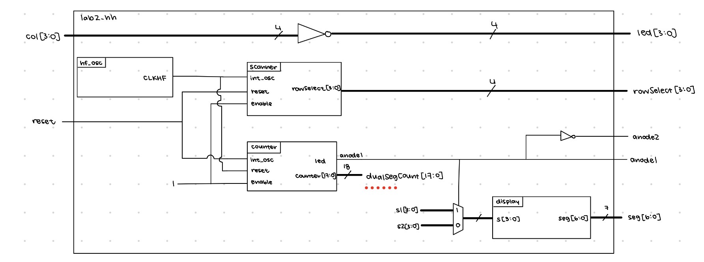
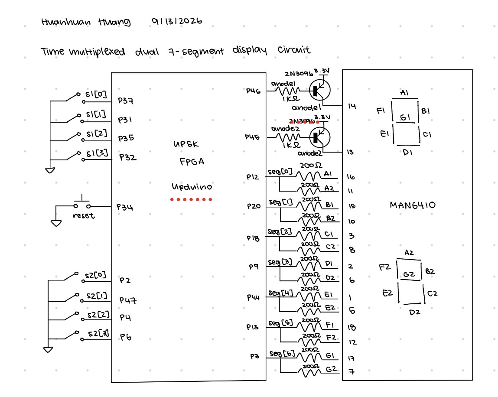
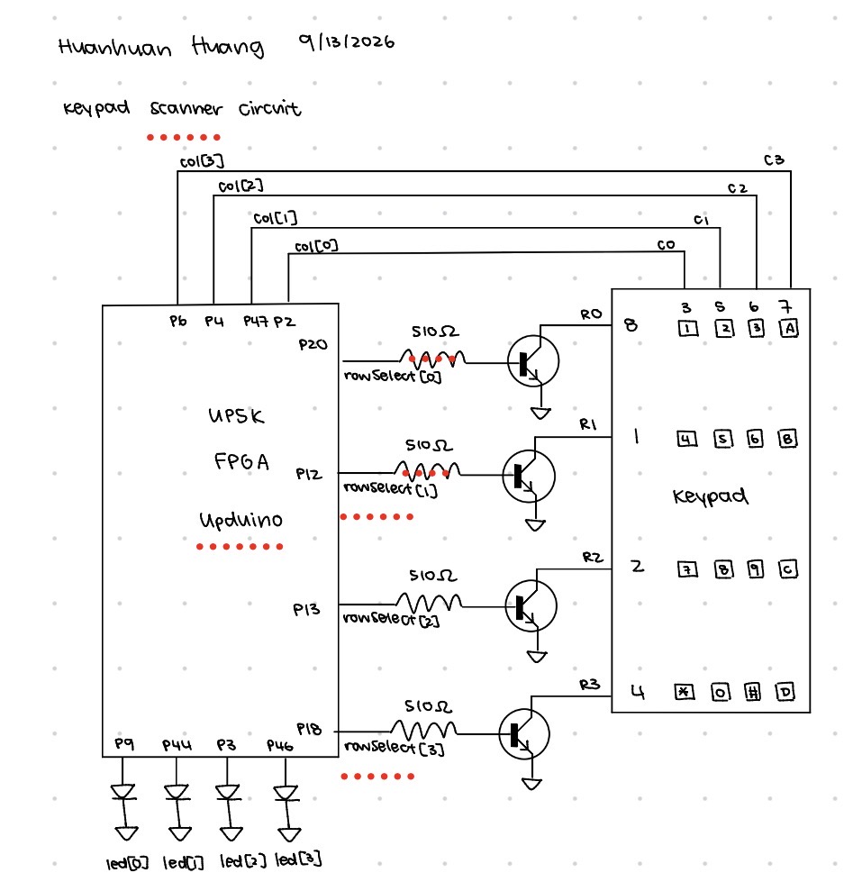
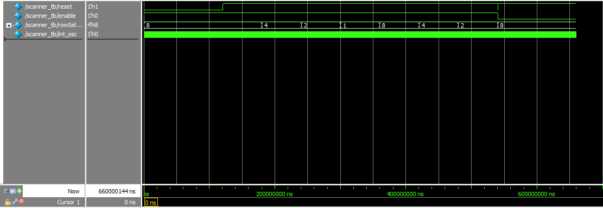
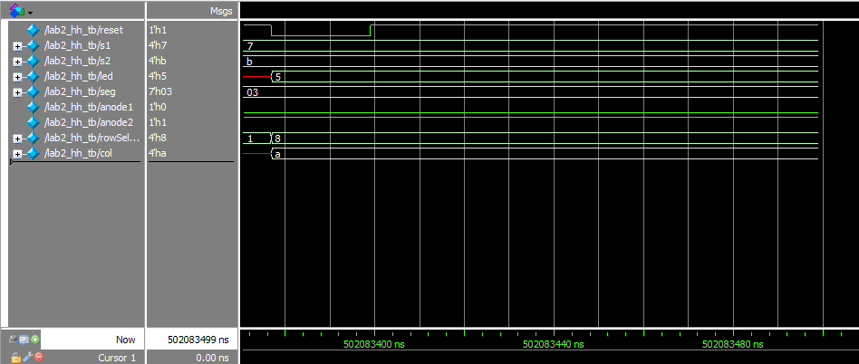
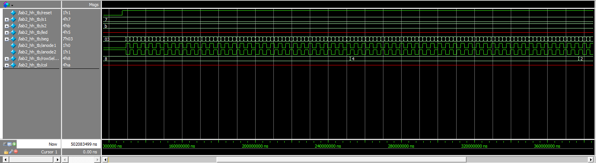
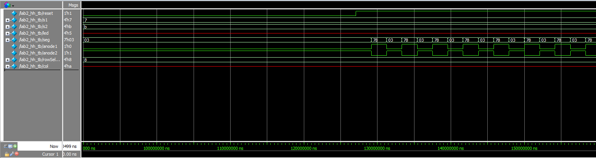

# Introduction
In this lab, a dual 7 segment display was controlled using time multiplexing at 240Hz, and a 4x4 keypad scanner controlled LEDs that would light up on a key press. 

# Design and Testing Methodology
The RTL was structured as a top level module that inherited from three submodules: a display, a counter, and a scanner module. The display module and counter modules were reused from the previous lab. The scanner module created an instance of a counter that controlled which rows of the keypad were active so that in each 2Hz cycle, all four rows would be ON once. This required modifying the counter module to output the count so that each cycle could be divided evenly. Since the high speed oscillator was at 48MHz but the desired blinking frequency is 2Hz, the counter had to count to 24,000,000 oscillator cycles. Using the same math as the previous lab, the count was determined using the following calculation. 

$$ \frac{1}{2Hz} = N \cdot \frac{1}{48MHz}$$
$$N = 24000000$$

By being able to see the count, we can determine which LED is ON at a time by looking at whether the current count is under 3million, between 3 and 6 million, between 6 and 9 million, or greater than 9 million. 

Two testbenches were written, one for the top level module, and one for the scanner module. The scanner module checked that when enabled, there was always one row that was ON, and that each row was ON for 0.5s/4 or 0.125 seconds. The reset and enables were also tested. The top level module checked that the two anode pins that turn the two displays ON or OFF continuously switched along with the value that was being driven on the segment pins. The top level module also tested to ensure that the scanner works inside the top level module. Column values were also fed into the top level module and controlled whether LEDs turned on in response to a key press on the keypad, so LED values were also tested. 

Since we needed to control the dual seven segment display, I wired it up on a breadboard where the breadboard module was placed. The actual segment pins all were connected from the adapter pin to the segment pin using a resistor and jumper wires. The resistor controls the current that flows into the 7 segment display. Using the same math as Lab 1, the resistor values are calculated using Ohm's law R = V/I. The board powers 3.3V, the potential difference due to the LED approximated using the ON/OFF model is roughly 2V, and a safe current is 5-20mA per pin. 

$$R > \frac{3.1-2V}{20mA}$$
$$R < \frac{3.1-2V}{5mA}$$
I chose to use 200 Ohm resistors for all segments so that they all had the same brightness and current flowing through. 

To turn the anodes ON or OFF, the anode output pins from the breadboard module were each connected to the base of a PNP transistor. The collector of the PNPs were connected to 3.3V and the emitter was connected to the anode pins of the display. The base of the PNPs were connected to resistors that connected back to the FPGA for the anode outputs. The maximum current draw from the FPGA is 8mA, and the voltage drop from the collector to base is 0.7V and from base to emitter is also 0.7V. For the PNP, the resistor is between base and the FPGA pin, which is active low, so 

$$R > \frac{3.3V - 0.7V}{8mA} = 325 \Omega $$

I chose to use 1k Ohm resistors for current limiting for the PNPs. Assuming the threshold voltage for the yellow LEDs is 2V and the current draw from the FPGAs for the LEDs must be limited to 8mA or less, the resistor between FPGA pins and LEDs must be greater than or equal to 

$$R > \frac{3.1-2V}{8mA} = 137.5 \Omega $$

so I chose to use 200 Ohm resistors. 

For the keypad circuit, I connected the scanner row output to resistors that connected to the base of NPN transistors which can be 3.3V, and the emitter is connected to ground. There is a 0.7V drop between the base and the emitter, so 

$$R > \frac{3.3-0.7V}{8mA} = 325 \Omega $$

I ended up using 510 Ohm resistors. 

The emitters were grounded, and the collectors had internal pullup. The collector nodes were then connected to the row pins of the keypad, and the column pins were connected back to the FPGA where they would be used to control LEDs. 

# Technical Documentation
[Git repository for Lab 1](https://github.com/zssmgosh/e155-lab2)

::: {.callout-note collapse="true"}
## Block diagrams

:::

::: {.callout-note collapse="true"}
## Schematics

:::

# Results and Discussion
The time multiplexing dual segment display and the keypad scanner circuit both meet their objectives. The LEDs for the scanner circuit complete a cycle of rotations at 2Hz, or each LED is on for 0.125s before switching to the next. The time multiplexing circuit is flashing fast enough that it looks as if both are always on, and they are not bleeding into each other. 

::: {.callout-note collapse="true"}
## Testbench waveform results

:::

# Conclusion
This lab took roughly 10-11 hours to complete. I think it was cool to learn about and use transistors in this lab. It would have been nice if all the pins could fit on the breadboard adapter, but because they couldn't I had to create two pdc files. 

# AI Prototype
::: {.callout-note collapse="true"}
For the first prompt that doesn't provide the display and counter modules, the AI (Gemini) result placed the display in the module, and the encodings for each segment are actually correct and inverted for the anode driven display. It created two instances of segments and muxes them using the same signal that muxes the input switch, which is unnecessary hardware. Otherwise, it works, but it seems that the AI only thinks in terms of code functionality less so hardware. 

For the second prompt where Gemini has access to the counter and display modules, its output also works, but it introduces unnecessary sequential logic for the display. It tries to reset the display as well, but it's not really necessary and just adds new hardware. Additionally, it counts to 100,000, but uses a 32 bit register to store the value, which is bigger than needed. The muxing and select logic is the same as what I have. Basically, AI can write working code, but cannot write efficient hardware. 
:::