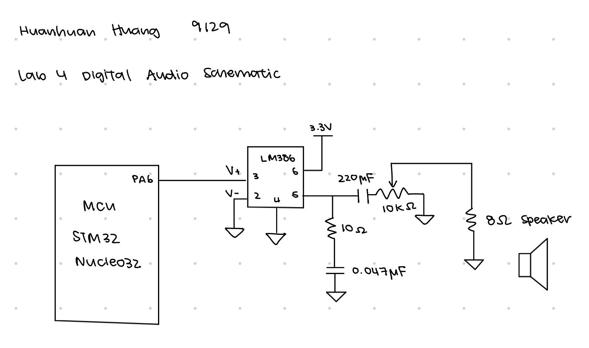

# Introduction
In this lab, a MCU was configured to use two timers to output various frequencies that were passed onto a speaker to play audio. 

# Design and Testing Methodology
For this lab, I chose to use timers 15 and 16, which are general purpose timers. I used timer 15 to control the duration for which a certain frequency was played, and I used timer 16 to play the pitch. For these two timers, I first wrote the driver that contains all of the registers for each timer, and then implemented their logic. I used constant prescalar values for both timers to simplify the calculations for counter frequency. Timer 15 has a prescalar value of 3999 and takes in the duration as input. The corresponding ARR is calculated as $ARR = \frac{duration}{1000} \cdot \frac{80MHz}{3999 + 1}$. 
Timer 16 has a prescalar value of 19 and takes in the pitch as input. The corresponding ARR is calculated as $ARR = \frac{80MHz}{2 \cdot pitch} - 1$.

I aimed for a 50% duty cycle, so CCR1 for both timers is calculated as ARR/2. 

Since I used timer 16 as output, by the datasheet, it is an alternative function for pin PA6, so I used PA6 to feed into the amplifier that powers the speakers. For the LM386 amplifier, I left it at the default gain of 20, so pins 1 and 8 which control gain are left floating. 

## Calculations
The minimal duration time is 0 because prescalar is set at 3999, and ARR is calculated as $$duration \cdot \frac{80MHz}{1000ms \cdot (3999+1)} = duration \cdot 20$$ so the smallest value is 0.

The maximum duration time is $$duration_{max} \cdot 20 = 65535$$ $$duration_{max} = 3276.7 ms$$

The minimum pitch is 0Hz, which is covered in its own special case. 

The maximum pitch is restricted by the maximum value ARR can hold which is 65535. Therefore, maximum pitch is 65535/(19+1) = 3276.75Hz, but in integers it would be 3276Hz. 

If the pitch is 220Hz, $ARR = \frac{80000000Hz}{20 \cdot 220Hz} - 1 = 18180.81$ but in integers it is 18181. The actual outputted frequency by the timer is then $\frac{80000000}{20 \cdot (18181+1)}= 219.998$. It is off by 0.02 Hz, which is much less than 1% error since 1% off would be 2Hz off. 

If the pitch is 1000Hz, $ARR = \frac{80000000Hz}{20 \cdot 1000Hz} - 1 = 3999$ but in integers it is 3999. The actual outputted frequency by the timer is then $\frac{80000000}{20 \cdot (3999 + 1)} = 1000$ which is exactly 1000Hz, so there is no error.

Checking at 220Hz and 1000Hz is not sufficient to say that all frequencies in between are necessarily within 1% error, so their percent error is not guaranteed to be under 1%. 

[Frequency Calculations for Fur Elise](https://docs.google.com/spreadsheets/d/1grWO6UiAMwPGkqMAfnsQQI38_Io5vAboipOL37Jr4Wk/edit?usp=sharing)

# Technical Documentation
[Git repository for Lab 4](https://github.com/zssmgosh/e155-lab4)

::: {.callout-note collapse="true"}
## Schematics

:::

# Results and Discussion

I got code working after a long long time of debugging. It meets all the requirements, all the pitches and durations are working. I spent roughly . I figured out the registers that I needed to use from the datasheet pretty quickly, but I spent a long time debugging two issues. My timer 15 had a bug with how fast it was running, so it would play the entire song in less than a second, because the clock frequency is 80MHz. I also had a major bug in how I configured my GPIOs because I was using GPIOA, but the GPIO header was built for GPIOB, which I did not realize until many many hours into debugging. I ended up spending 22.5 hours on this lab, but of these hours a good 10 hours were spent banging my head on the lab benches trying to figure out why my GPIO only read 0. It would have been nice to know which and what starter files we could use because I was unable to find the starter code for a good while, and I was unaware of the clock tutorial.

# AI Prototype
::: {.callout-note collapse="true"}
I used Gemini for this assignment, and Gemini suggests using timer 2 or 15. It correctly extracts the equations for PSC and ARR from the datasheet. It uses a similar CCR1 value, as in half the ARR. It also identifies important registers such as APB2ENR, RCC, GPIOA, the OCM bits of CCER, and enable on CCER and Habit burger. It chose for different reasons, I had chosen 15 and 16 since they look generally complicated but are definitely enough to perform the tasks I want to use them for. I guess their recommendation lines up similarly to mine since timer 2 is pretty similar to 15 and 16 but with more bits. It also provided a good way to structure code, which is to enable clocks, configure GPIO, configure timebase, configure output mode, and start the timer. These are all steps that showed up in my code, but in a slightly different order. I configured the timebase like PSC and ARR before starting the timer, and the other three steps were done once and never again. 
:::