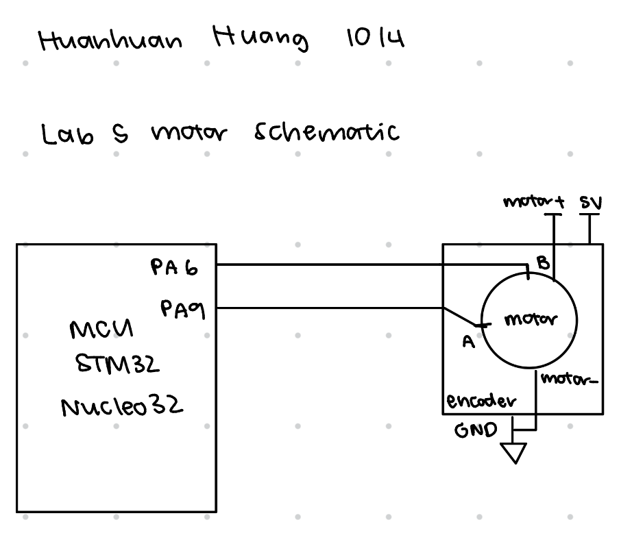
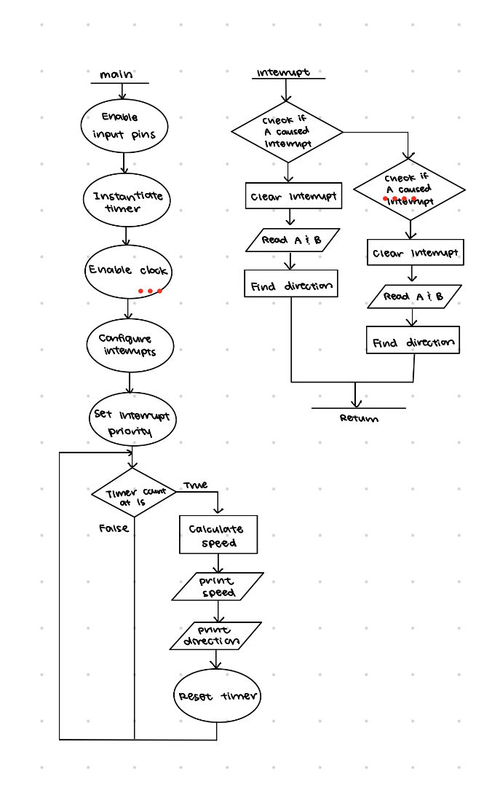

# Introduction
In this lab, a MCU was configured to take in interrupts from a motor encoder to read the speed and direction of a motor. 

# Design and Testing Methodology
For this lab, I chose to use a single timer to control the frequency at which we print out the speed and direction to be 1Hz. The calculations for this timer are in the calculations section below. 

In the interrupt handler, we add to the pulse counter every time we enter the interrupt handler, and we check the direction. Speed is calculated every second right before the print, because the number of pulses observed at that moment are representative of the number of pulses encountered by A and B in the span of a second. We set the priority of the timer higher than the motor encoder interrupts, because we want to have a guaranteed 1 second period for each measurement. Since we measure every second, the timer interrupt only occurs on rising edge of UIF, which is when we stop the counter to print speed and direction, and the pulse count is reset to 0. This basically means the timer interrupt does not affect the pulse counting because we reset it every time we are on a new second, and counting pulses during that second will not be interfered with. 

Interrupts were used instead of constant polling, because interrupts guarantee that all edges are recorded by the MCU, If we manually poll and dont have a good frequency, it's possible to miss edges if the clock for polling isn't fast enough because it's not guaranteed that polling frequency and motor's angular frequency are synchronized, so loss of data is introduced. The downside of this is that interrupts stall everything when triggered, so time to perform a task slows down. 

## Calculations
The internal clock is 1MHz, and in the timer, we use a prescalar value of 1MHz/10000 - 1 = 99 to give us a maximum count (ARR) value of 10000 if we want the timer to count to 1s every time. Both encoder pins A and B were read as input interrupts on both rising and falling edges. That means for each magnet that passes through, we count it four times, on A's rising and falling edges and on B's rising and falling edges. This means that by the time a second is up, we have taken 4 times the number of pulses that were encountered in that one second. 

Given that the number of pulses per revolution is 408 pulses and that we count 4 measurements per pulse, if we have a set 1 second period for measuring, we can obtain the speed by using the number of observed pulses $count$ divided by pulses per revolution to find that $$speed = \frac{count}{4 \cdot 408}$$

On the motor, if we rotate counterclockwise, we would encounter a magnet at B before the same magnet is detected at A. To determine direction, the four cases where we should see CCW is:
    - on falling edge of B, A is high
    - on a rising edge of B, A is low
    - on falling edge of A, B is high
    - on rising egde of A, B is low
The remaining four cases would indicate clockwise movement of the motor. 

Assuming 2.5 rev/s is the maximum speed of the motor and there are 408 pulses per revolution, if we were to use polling, we would need to capture all 1020 pulses in that second. However, if we want direction, we would need to be able to capture rising edge and falling edges, because just knowing A and B are 90 degrees phase shifted is not enough, because without knowing falling edge or rising edge, it would be impossible to determine which signal's rising edge is ahead of the other. If we divide down a single period of a pulse on A to the minimum resolution to capture B, we would need at least 4 samples per pulse because we can take a sampling point at every 90 degrees. This would mean a polling frequency of at least 4080Hz or any multiple of it. This is the worst case though. However, if the motor spins less fast, then using this same frequency would not be able to guarantee how many measurements are tied to the same pulse, because the number of readings per pulse could change if it doesn't divide up nicely. Interrupts are much better in comparison just because the number sampels per pulse is constant regardless of speed. 

# Technical Documentation
[Git repository for Lab 5](https://github.com/zssmgosh/e155-lab5)

::: {.callout-note collapse="true"}
## Schematics

:::

::: {.callout-note collapse="true"}
## Flow Chart

:::

# Results and Discussion

I spent a total of 10.5 hours on this lab. My design is working, the speed and direction readings are stable. Everything went pretty well, except I forgot to enable the PA pins on hardware instead of software, so the pulsing from the motors was never read by the MCU. I think I wasted 1.5 hours there. At first we tried to have interrupt priority over timer, but that didn't work because we saw really weird speed values when voltage was kept constant. Then we changed our approach to have a set 1second period of counting pulses to determine speed, which didn't take a long time to implement, but we did not specs very carefully and had to make 2 edits on top of that implementation. 

# AI Prototype
::: {.callout-note collapse="true"}
I used Gemini for this assignment, and Gemini suggests that we don't use interrupts at all and instead use timers. It suggested me to use timers 2 and timer 1. The suggested approach is wildly different from my implementation and is unusually short. It does not compile since there is barely any code and does not use functions in the programming manual nor the code in the libraries that we wrote. It does suggest an alternative method that does use interrupts and suggests pins PA0 and PA1, both of which are safe according to the manual. However, I believe these pins are used for other purposes on our FPGA, so it would not run. It uses a lookup table containing three values for clockwise, counterclockwises, and jittery motion, arranged in a 4 x 4 array. It also uses functions in the hardware abstraction layer that we don't touch.
:::